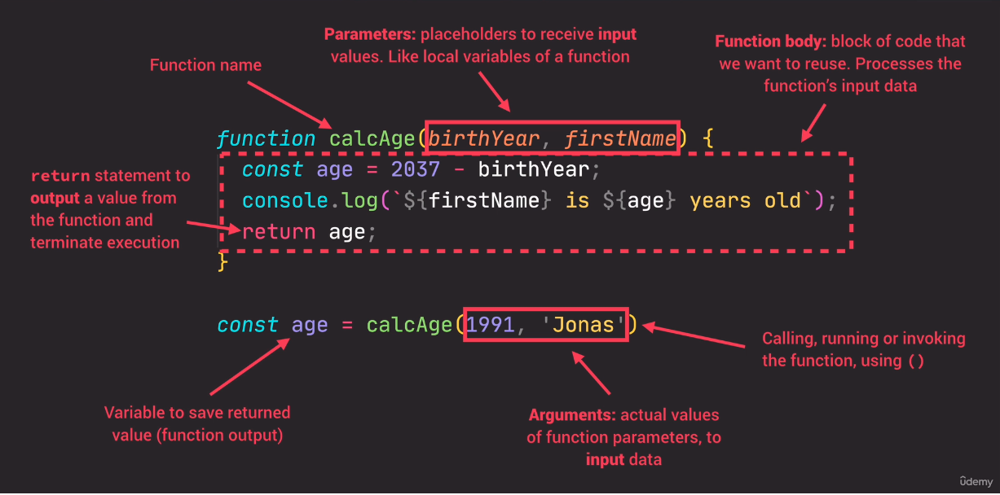

# JavaScript Fundamentals - Part 2

## Table of contents
* [Strict Mode](#strict-mode)
* [Functions](#functions)
* [Function Declarations vs. Expressions](#function-declarations-vs-expressions)
* [Arrow Functions](#arrow-functions)
* [Functions Calling Other Functions](#functions-calling-other-functions)
* [Reviewing Functions](#reviewing-functions)
* [Introduction to Arrays](#introduction-to-arrays)
* [Basic Array Operations (Methods)](#basic-array-operations-methods)
* [Introduction to Objects](#introduction-to-objects)
* [Dot vs. Bracket Notations](#dot-vs-bracket-notation)
* [Object Methods](#object-methods)

## Strict Mode
A way to opt in to a restricted variant of JavaScript. Strict mode forbids us to do certain things and creates visible errors in the development console.
This has to be the first line in the js file.
```
'use strict';
```

## Functions
A function is a piece of code that we can reuses over and over again in our code.
```
function logger() {
    console.log('This is a function named logger');
}

// calling, running or invoking the function
logger();

function funcWithParameters(first, second) {
    console.log(first);
    console.log(second);
}

funcWithParameters('first param', 'second param');
```
parameter is the placeholder in the function (birthYear) and the argument (1990) is the actual value to fill in the placeholder.

## Function Declarations vs. Expressions
Function decleration:
```
function calcAge(birthYear) {
    return 2023 - birthYear;
}

console.log(calcAge(1970));
```

Function Expression:
```
const calcAge = function (birthYear) {
    return 2023 - birthYear;
}

console.log(calcAge(1970));
```

Function declerations can be called before they are defined, but function expressions can't be called before being initialized.

## Arrow Functions
Introduced in ES6. Arrow functions do not get the this keyword!
```
const calcAge = birthYear => 2023 - birthYear;
console.log(calcAge(1970));

const yearsUntilRetirement = birthYear => {
    const age = 2023 - birthYear;
    const retirement = 67 - age;
    return retirement;
}
console.log(yearsUntilRetirement(1970));

const multipleParameters = (first, second) => `${first} and ${second}`;
console.log(multipleParameters('my', 'something'));
```

## Functions Calling Other Functions
```
function callMeFromOtherFunction(text) {
    return `you called me with text ${text}`;
}

function callingOtherFunction(text) {
    const returnedText = callMeFromOtherFunction(text);

    return returnedText;
}

console.log(callingOtherFunction('call the other function'));
```

## Reviewing Functions
Function declaration: Function that can be used before it's declared.  
Function expression: Essentially a function value stored in a variable.  
Arrow function: Great for a quick one-line function.  
Three different ways of writing functions, but they all work in a similar way: receive input data, transform data, and then ourput data.

Anatomy of a function:  


## Introduction to Arrays
```
const friends = ['friend1', 'friend2', 'friend3'];
console.log(friends); // ["friend1", "friend2", "friend3"]
console.log(friends[0]); // "friend1"
console.log(friends[1]); // "friend2"
friends[2] = 'friendX';
console.log(friends); //["friend1", "friend2", "friendX"]

const years = new Array(1901, 1990, 2000, 2020);
console.log(years);
console.log(years.length); //4
```

## Basic Array Operations (Methods)
```
const friends = ['friend1', 'friend2', 'friend3'];
console.log(friends); // ["friend1", "friend2", "friend3"]

// Add element to the end of the array
friends.push('friend4); // push returns the length of the array
console.log(friends); // ["friend1", "friend2", "friend3", "friend4"]

// Add element to the beginning of the array
friends.unshift('friend0'); // unshift returns the length of the array
console.log(friends); // ["friend0", "friend1", "friend2", "friend3", "friend4"]

// Remove the last element
friends.pop(); // pop returns the removed element
console.log(friends); // ["friend0", "friend1", "friend2", "friend3"]

// Remove the first element
friends.shift(); // unshift returns the removed element
console.log(friends); // ["friend1", "friend2", "friend3"]

console.log(friends.indexOf('friend3')); // 2
console.log(friends.indexOf('friendX)); // -1

//ES6 method
console.log(friends.includes('friend2')); // true
console.log(friends.includes('friendX')); // false
```

## Introduction to Objects
In objects we define key-value pairs. There are multiple ways to creating objects. Using the curly braces is called the object literal syntax. Because we are literally writing the entire object content.
```
// the object myObject has 5 properties (firstName, lastName, ...)
const myObject = {
    firstName: 'first',
    lastName: 'last'
    age: 2023 - 1901,
    job: 'developer',
    friends: ['friend1', 'friend2', 'friend3']
}
```

## Dot vs. Bracket Notation
First way of getting a property from an object is by using the dot notation.
```
const myObject = {
    firstName: 'first',
    lastName: 'last',
    age: 2023 - 1901,
    job: 'developer',
    friends: ['friend1', 'friend2', 'friend3']
}
console.log(myObject.lastName); // last
console.log(myObject.something); // undefined
```

We can do the same thing using the bracket notation. In the brakcet notation we can put any expression we like. We can compute it from any operation.
```
console.log(myObject['lastName']); // last
console.log(myObject['something']); // undefined

const nameKey = 'Name';
console.log(myObject['first' + nameKey]); // first
console.log(myObject['last' + nameKey]); // last
```

to add new properties using the dot and bracket notation
```
myObject.location = 'somewhere';
myObject['street'] = 'streetX';
```

## Object methods
Objects can hold different types of data. They can hold arrays and even an object inside an object.  
Functions are just a type of a value. And if a function is just a value, we can create a key/value pair, where the value is a function.  
Any function that is attached to a object is called a method.  
```
const myObject = {
    firstName: 'first',
    lastName: 'last',
    birthYear: 1901,
    job: 'developer',
    friends: ['friend1', 'friend2', 'friend3'],
    calcAge: function(birthYear) {
        return 2023 - birthYear;
    }
}

console.log(myObject.calcAge(1901)); // 122
console.log(myObject['calcAge'](1901)); // 122
```
We can read the birthYear from the object itself using the `this` keyword. The `this` keyword is equal to the object calling the method.
```
const myObject = {
    firstName: 'first',
    lastName: 'last',
    birthYear: 1901,
    job: 'developer',
    friends: ['friend1', 'friend2', 'friend3'],
    calcAge: function() {
        return 2023 - this.birthYear;
    }
}
console.log(myObject.calcAge()); // 122
```
Instead of computing the age every time we call the calcAge function, we can store it in the object itself.
```
const myObject = {
    firstName: 'first',
    lastName: 'last',
    birthYear: 1901,
    job: 'developer',
    friends: ['friend1', 'friend2', 'friend3'],
    calcAge: function() {
        this.age = 2023 - this.birthYear;
        return this.age;
    }
}
console.log(myObject.calcAge()); // 122
console.log(myObject.age); // 122
```