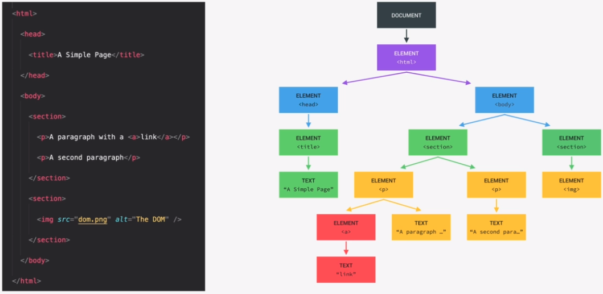

# JavaScript in the Browser: DOM and Events Fundamentals

## Table of contents
* [What's the DOM and DOM Manipulation](#whats-the-dom-and-dom-manipulation)
* [Selecting and Manipulating Elements](#selecting-and-manipulating-elements)
* [Handling Click Events](#handling-click-events)

## What's the DOM and DOM Manipulation
Document object model: Structured representation of HTML documents. Allows JavaScript to access HTML elements and styles to manipulate them.  
Example of manipulation: Change text, HTML attributes and CSS styles.  
It is stored in a tree structure. 



The DOM always starts with the document object at the top of the tree. It is a special object that is the entry point to the DOM. Example: `document.querySelector()`  
DOM methods and properties for DOM manipulation are not a part of JavaScript. The DOM methods and properties are part of the WEB APIs which can interact with JavaScript.

## Selecting and Manipulating Elements
`message` here is a class on an html element.
```
<p class="message">A message</p>
// Selecting
console.log(document.querySelector('.message').textContent); // 'A message'
// Manipulating
document.querySelector('.message').textContent = 'A new message';
console.log(document.querySelector('.message').textContent); // 'A new message'
```

## Handling Events
We can handle events with an eventlistener.
```
// First select the element where the event should happen. i.e. a button
<button class="btn">A Button</button>
document.querySelector('.btn').addEventListener('click', function() {
    console.log('You clicked on the button!');
})

// listen to events everywhere
document.addEventListener('keydown', function(event) {
    console.log(event);
})
```
3 types of events for the keyboard:
- keydown 
- keypress
- keyup