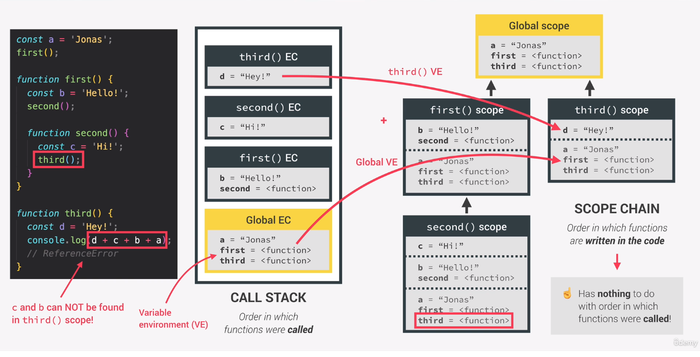
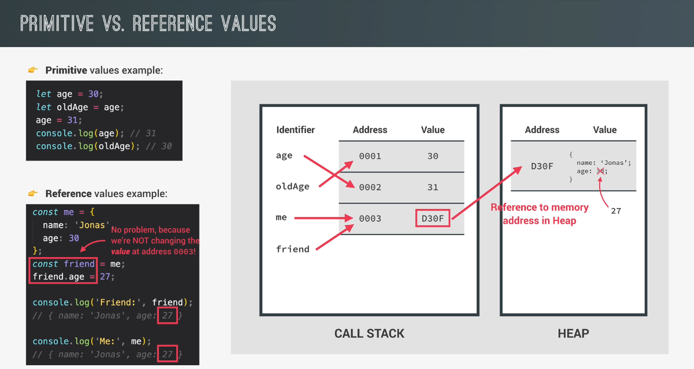

# How JavaScript works behind the scenes

## Table of contents
* [An High-level overview of JavaScript](#an-high-level-overview-of-javascript)
* [The JavaScript Engine and Runtime](#the-javascript-engine-and-runtime)
* [Execution Contexts and the Call Stack](#execution-contexts-and-the-call-stack)
* [Scope and the Scope Chain](#scope-and-the-scope-chain)
* [Variable Environment: Hoisting and the TDZ](#variable-environment-hoisting-and-the-tdz)
* [The this keyword](#the-this-keyword)
* [Regular Functions vs. Arrow Functions](#regular-functions-vs-arrow-functions)
* [Primitives vs. Objects (Primitive vs. Reference Types)](#primitives-vs-objects--primitive-vs-reference-types-)

## An High-level overview of JavaScript
JavaScript is a high-level prototype-based object-oriented multi-paradigm interpreted or just-in-time compiled dynamic single-threaded garbage-collected programming language with first-class functions and a non-blocking event loop concurrency model.

* High-level: Developer does not have to worry about resources (memory, cpu).
* Garbage collection: an algorithm inside the javascript engine which automatically removes old unused object from the memory.
* Interpreted or just-in-time compiled language: compiling => convert the codeto machine code
* Multi-paradigm: An approach and mindset of structuring code, which will direcct your coding style and technique. Three popular paradigms are procedural programming, object-oriented programming (OOP), functional programming (FP)
* Prototype-based object-oriented: everything in JavaScript is an object, except for primitive values. Objects are created from prototypes
* First-class functions: functions are treated as variables. We can pass them into other functions, and return them from functions
* Dynamic: dynamically-typed language. No data type definitions. Types becomes known at runtime. Data type of variable is automatically changed
* Single-threaded: JavaScript runs in one single thread, so it can only do one thing at a time
* Non-blocking event loop: takes long running tasks, executes them in the "background", and puts them back in the main thread once they are finished

## The JavaScript Engine and Runtime
* A JavaScript engine is a program that executes JavaScript code. Example: Google V8 Engine  
* A JavaScript engine always contains a call stack and a heap. The call stack is where our code is executed using an execution context. The heap is an unstructured memory pool that stores all the objects that our application needs.  

Compilation: Entire code is converted into machine code at once, and written to a binary file that can be executed by a computer.  
Interpretation: Interpreter runs through the source code and executes it line by line. (code still need to be converted to machine code)
Just-in-time (JIT) compilation: Entire code is converted into machine code at once, then executed immediately.

What happens when a piece of code enters a JavaScript engine ?
1. Code enters the JavaScript engine
2. The code gets parsed to AST (Abstract Syntax Tree)
3. The generated AST gets compiled into machine code
4. The machine code gets executed immediately
5. During execution the code is being optimized and gets re-compiled and re-executed

JavaScript runtime is a container including all the things we need to use JavaScript.

## Execution Contexts and the Call Stack
### What is an execution context
An execution context is an environment in which a piece of JavaScript is executed. Stores all the necessary information for some code to be executed.  
Once the code is compiled it is ready to be executed. A global execution context is created for the top-level code (code that is not inside a function). There is exactly one global execution context: Default context, created for code that is not inside any function (top-level).  
Next the top-level code is executed inside the global execution context. Then execution of functions and waiting for callbacks. There is one execution context per function: For each function call a new execution context is created.  
All the execution contexts together make the call stack.

### What's inside execution context
1. Variable environment
    * let, const and var declerations
    * Functions
    * arguments object
2. Scope chain
3. `this` keyword

This all is generated during "creation phase", right before execution.  
Note: Execution contexts belonging to arrow functions do not get their own arguments object and the `this` keyword.  

The call stack is a place where execution contexts get stacked on top of eacht other, to keep track of where we are in the execution. The execution context that is on top of the stack is the one that is currently running. Once it is finished it is being removed from the stack and execution will go back to the previous execution context.

## Scope and the Scope Chain
* Scoping: How our program's variables are organized and accessed. "Where do variables live?" or "Where can we access a certain variable, and where not?"
* Lexical Scoping: Scoping is controlled by placement of functions and blocks in the code.
* Scope: Space or environment in which a certain variable is declared (variable environment in case of functions). There is global scope, function scope and block scope.
* Scope of a variable: Region of our code where a certain variable can be accessed.
* Scope has access to variables from all outer (parent) scopes.

3 types of scope:
* global: Is for top-level code. Outside of any function or block. Variables declared in global scope are accessible everywhere.
* function: Each function creates a scope. Variables are accessible only inside function, not outside. Also called local scope.
* block: Introduced in ES6. Variables are accessible only inside block (block scoped). However, this only applies to let and const variables. Functions are also block scoped (starting from ES6 and only in strict mode)

Scope chain vs. Call Stack
* Scope chain: order in which functions are written in the code. Has nothing to do with the order in which functions were called.
* Call stack: order in which functions are called



Summary:
* Scoping asks the question "Where do variables live?" or "Where can we access a certain variable, and where not?"
* There are 3 types of scope in JavaScript: the global scope, scopes defined by functions, and scopes defined by blocks;
* Only let and const variables are block-scoped. Variables declared with var end up in the closest function scope;
* In JavaScript, we have lexical scoping, so the rules of where we can access variables are based on exactly where in the code functions and blocks are written;
* Every scope always has access to all the variables from all its outer scopes. This is the scope chain!
* When a variable is not in the current scope, the engine looks up in the scope chain until it finds the variable it's looking for. This is called variable lookup;
* The scope chain is a one-way street: a scope will never, ever have access to the variables of an inner scope;
* The scope chain in a certain scope is equal to adding together all the variable environments of all the parent scopes;
* The scope chain has nothing to do with the order in which functions were called. It does not affect the scope chain at all!

## Variable Environment: Hoisting and the TDZ
Hoisting: Makes some types of variables accessible/usable in the code before they are actually declared. Before execution, code is scanned for variable declarations, and for each variable, a new propery is created in the variable environment object.

|                         | Hoisted | Initial value                               | Scope                                      |
|-------------------------|:-------:|:-------------------------------------------:|:------------------------------------------:|
| functions declarations  | yes     | Actual function                             | Block (in strict mode. otherwise function) |
| var variables           | yes     | undefined                                   | Function                                   |
| let and const variables | no      | \<uninitialized\>, TDZ (temporal dead zone) | Block                                      |
| function expressions    |         | depends if using var or let/const           |                                            |

Temporal dead zone, let and const
```
const myName = 'JS';

if (myName === 'JS') {
    console.log(`JS is a ${description}`);       // TDZ for description variable. Gives a ReferenceError: Cannot access 'description' befire initialization.
    const lastName = 'language';                 // TDZ for description variable
    console.log(lastName);                       // TDZ for description variable
    const description = 'programming language';
    console.log(x);                               // Gives a ReferenceError: x is not defined
}
```
Why TDZ ?
* Makes it easier to avoid and catch errors: accessing variables before declaration is bad practice and should be avoided.
* Makes const variables actually work.

Why Hoisting ?
* Using functions before actual declaration.
* var hoisting is just a byproduct of hoisting functions.

## The this keyword
* A special variable that is created for every execution context (every function). Takes the value of (points to) the "owner" of the function in which the this keyword is used.
* this is not static. It depends on how the function is called, and its value is only assigned when the function is actually called.
* this does not point to the function itself, and also not to its variable environment.

| Way of calling a function | this value                                                                                              |
|---------------------------|---------------------------------------------------------------------------------------------------------|
| method                    | Object that is calling the method                                                                       |
| simple function call      | undefined (in strict mode. Otherwise window (in the browser))                                           |
| Arrow functions           | this of surrounding (parent) function (lexical this). Arrow functions don't have their own this keyword |
| Event listener            | DOM element that the handler is attaced to                                                              |

## Regular Functions vs. Arrow Functions
When using this in a regular function in strict mode, the this keyword is undefined. When using the this keyword in not strict mode, the this keyword is the global object.  
Arrow functions do not have its own this keyword. It will use the this keyword from its parent.
```
const me = {
  firstName: 'me'
  greet1: function () {
    console.log(`Hey ${this.firstName}`);
  }
  greet2: () => { 
    console.log(`Hey ${this.firstName}`);
  }
}
me.greet1(); // Hey me
me.greet2(); // Hey undefined
```

## Primitives vs. Objects (Primitive vs. Reference Types)
Primitives (Primitive Types):
* Number
* String
* Boolean
* Undefined
* Null
* Symbol
* BigInt
Are stored in the CALL STACK (execution context)

Objects (Reference Types):
* Object literal
* Arrays
* Functions
* ...
Are stored in the HEAP



We can copy objects with Object.assign(). This only creates a shallow copy and not a deep clone.  
It will only copy the properties in the first level, while a deep copy will copy everything.
```
const me = {
  name: 'me',
  family: ['other', 'someone']
}
const meCopy = Object.assign({}, me);
meCopy.name = 'meCopy';
console.log(me.name);     // me
console.log(meCopy.name); // meCopy

meCopy.family.push('copy');
console.log(me.family);     // ['other', 'someone', 'copy']
console.log(meCopy.family); // ['other', 'someone', 'copy']
// Because of the shallow copy. The family object is a deeply nested object.
```