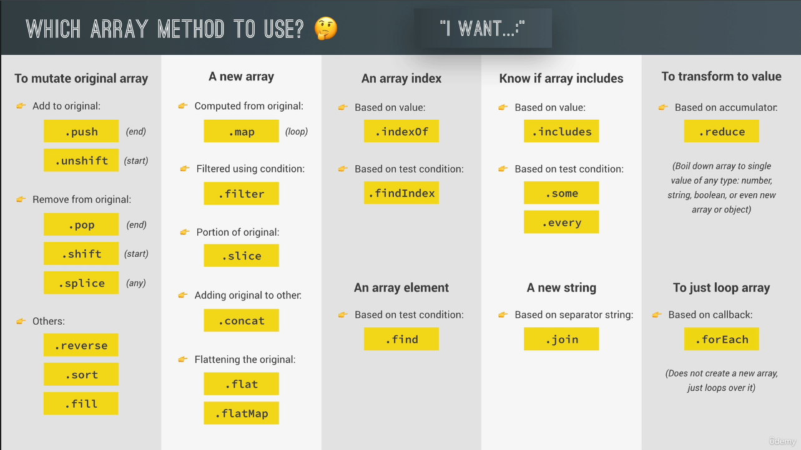

# Working with Arrays

## Table of contents
* [Simple Array Methods](#simple-array-methods)
* [Looping Arrays: forEach](#looping-arrays--foreach)
* [forEach With Maps and Sets](#foreach-with-maps-and-sets)
* [Data Transformation: map, filter, reduce](#data-transformations--map-filter-reduce)
* [Sorting Arrays](#sorting-arrays)
* [Creating and Filling Arrays](#creating-and-filling-arrays)
* [Summary](#summary)

## Simple Array Methods
* Arrays are objects and get access to special build-in methods
* [Slice](https://developer.mozilla.org/en-US/docs/Web/JavaScript/Reference/Global_Objects/Array/slice)
* [Splice](https://developer.mozilla.org/en-US/docs/Web/JavaScript/Reference/Global_Objects/Array/splice)
* [Reverse](https://developer.mozilla.org/en-US/docs/Web/JavaScript/Reference/Global_Objects/Array/reverse)
* [Concat](https://developer.mozilla.org/en-US/docs/Web/JavaScript/Reference/Global_Objects/Array/concat)
* [Join](https://developer.mozilla.org/en-US/docs/Web/JavaScript/Reference/Global_Objects/Array/join)
* [At](https://developer.mozilla.org/en-US/docs/Web/JavaScript/Reference/Global_Objects/Array/at)
* [Filter](https://developer.mozilla.org/en-US/docs/Web/JavaScript/Reference/Global_Objects/Array/filter)
* [Find](https://developer.mozilla.org/en-US/docs/Web/JavaScript/Reference/Global_Objects/Array/find)
* [FindIndex](https://developer.mozilla.org/en-US/docs/Web/JavaScript/Reference/Global_Objects/Array/findIndex)
* [Includes](https://developer.mozilla.org/en-US/docs/Web/JavaScript/Reference/Global_Objects/Array/includes)
* [Some](https://developer.mozilla.org/en-US/docs/Web/JavaScript/Reference/Global_Objects/Array/some)
* [Every](https://developer.mozilla.org/en-US/docs/Web/JavaScript/Reference/Global_Objects/Array/every)
* [Flat](https://developer.mozilla.org/en-US/docs/Web/JavaScript/Reference/Global_Objects/Array/flat)
* [FlatMap](https://developer.mozilla.org/en-US/docs/Web/JavaScript/Reference/Global_Objects/Array/flatMap)
* [Fill](https://developer.mozilla.org/en-US/docs/Web/JavaScript/Reference/Global_Objects/Array/fill)
* [From](https://developer.mozilla.org/en-US/docs/Web/JavaScript/Reference/Global_Objects/Array/from)
* [MDN docs](https://developer.mozilla.org/en-US/docs/Web/JavaScript/Reference/Global_Objects/Array)
```
// Slice method - creates shallow copy
let arr = ['a', 'b', 'c', 'd', 'e'];
console.log(arr.slice(2)); // [ 'c', 'd', 'e' ]
console.log(arr.slice(2, 4)); // [ 'c', 'd' ]
console.log(arr.slice(-2)); // [ 'd', 'e' ]
console.log(arr.slice(1, -1)); // [ 'b', 'c' ]

// Splice method - mutates the original array
let arr = ['a', 'b', 'c', 'd', 'e'];
console.log(arr.splice(2)); // [ 'c', 'd', 'e' ]
console.log(arr); // [ 'a', 'b' ]
console.log(arr.splice(2, 0, 'c')); // []
console.log(arr); // [ 'a', 'b', 'c' ]
console.log(arr.splice(2, 1, 'd')); // [ 'c' ]
console.log(arr); // [ 'a', 'b', 'd' ]

// Reverse - mutates the original array
let arr = ['a', 'b', 'c', 'd', 'e'];
console.log(arr.reverse()); // [ 'e', 'd', 'c', 'b', 'a' ]
console.log(arr); // [ 'e', 'd', 'c', 'b', 'a' ]

// Concat - does not change the existing arrays
let arr1 = ['a', 'b', 'c'];
let arr2 = ['d', 'e'];
console.log(arr1.concat(arr2)); // ['a', 'b', 'c', 'd', 'e']
console.log(arr1); // ['a', 'b', 'c']
console.log(arr2); // ['d', 'e']

// Join
let arr = ['a', 'b', 'c', 'd', 'e'];
console.log(arr.join()); // a,b,c,d,e
console.log(arr.join('')); // abcde
console.log(arr.join('-')); // a-b-c-d-e

// At
let arr = ['a', 'b', 'c']
console.log(arr[0]); // a
console.log(arr.at(0)); // a
console.log(arr.at(-2)); // b

// Filter
const words = ['first', 'second', 'third', 'fourth', 'fifth'];
// Arrow function
const resultArrow = words.filter(word => word.length > 5);
// Regular function
const resultFunc = words.filter(function(word) {
    return word.length > 5;
});
console.log(resultArrow); // [ 'second', 'fourth' ]
console.log(resultFunc); // [ 'second', 'fourth' ]

// Find
const arr = [1, 3, 20, 2, 50];
const found = arr.find(el => el > 10);
console.log(found); // 20

// FindIndex
const arr = [1, 3, 20, 2, 50];
const found = arr.findIndex(el => el > 10);
console.log(found); // 2

// Includes
const arr = [1, 2, 3, 4, 5];
console.log(arr.includes(2)); // true

// Some
const arrayWithEvenNumbers = [1, 2, 3, 4, 5];
const arrayWithoutEvenNumbers = [1, 3, 5];
const even = (el) => el % 2 === 0;
console.log(arrayWithEvenNumbers.some(even)); // true
console.log(arrayWithoutEvenNumbers.some(even)); // false

// Every
const arrayWithEvenAndOddNumbers = [1, 2, 3, 4, 5];
const arrayWithOnlyEvenNumbers = [2, 4, 6];
const even = (el) => el % 2 === 0;
console.log(arrayWithEvenAndOddNumbers.every(even)); // false
console.log(arrayWithOnlyEvenNumbers.every(even)); // true

// Flat
const arr = [1, 2, [3, 4], 5];
console.log(arr.flat()); // [1, 2, 3, 4, 5 ]
const arrDeep = [[[1, 2], 3], 4, 5];
console.log(arrDeep.flat()); // [ [1, 2], 3, 4, 5 ]
console.log(arrDeep.flat(2)); // [ 1, 2, 3, 4, 5 ]

// FlatMap
const arr = [1, 2, 3, 4, 5];
console.log(arr.flatMap(num => num + 2)); // [3, 4, 5, 6, 7 ]

// Fill
const arr = [1, 2, 3, 4];
console.log(array1.fill(0, 2, 4)); // [ 1, 2, 0, 0 ]
console.log(array1.fill(5, 1)); // [ 1, 5, 5, 5 ]
console.log(array1.fill(6)); // [ 6, 6, 6, 6 ]

// From
console.log(Array.from('hello')); // [ 'h', 'e', 'l', 'l', 'o' ]
console.log(Array.from([1, 2, 3], x => x * 2)); [ 2, 4, 6 ]
console.log(Array.from({ length: 3 }, () => 1)); // [ 1, 1, 1 ]
```

## Looping Arrays: forEach
* forEach passes the current element, the index and the entire array we are looping to the callback function.
* continue and break statements do not work in forEach statement.
```
const numbers = [200, 450, -400, 3000, -650, -130, 70, 1300];

// For loop
for (const number in numbers) {
    console.log(number);
}

// forEach loop
numbers.forEach(function(number) {
    console.log(number); 
});
// 200
// 450
// -400
// ...
numbers.forEach(function(number, index, array) {
    console.log(number); // 200
    console.log(index); // 0
    console.log(array); // [200, 450, -400, 3000, -650, -130, 70, 1300]
}
numbers.forEach(number => console.log(number));
```

## forEach With Maps and Sets
```
const currencies = new Map([
  ['USD', 'United States Dollar'],
  ['EUR', 'Euro'],
  ['GBP', 'Pound Sterling'],
])

currencies.forEach(function(value, key, map) {
    console.log(value);
    console.log(key);
    console.log(map);
}
// United States Dollar
// USD
// { USD → "United States Dollar", EUR → "Euro", GBP → "Pound Sterling" }
// ...

const currenciesUnique = new Set(['USD', 'GBP', 'EUR', 'USD', 'EUR']);
currenciesUnique.forEach(function(value, key, set) {
    console.log(value);
    console.log(key);
    console.log(set);
});
// USD
// USD
// [ "USD", "GBP", "EUR" ]
```

## Data Transformations: map, filter, reduce
* [map](https://developer.mozilla.org/en-US/docs/Web/JavaScript/Reference/Global_Objects/Array/map): returns a new array containing the results of applying an operation on all original array elements.
```
const arr = [1, 2, 3, 4, 5];
// Arrow function
const mapArrayArrow = arr.map(x => x * 2);
// Regular function
const mapArrayFunc = arr.map(function(x) {
    return x * 2;
});
console.log(mapArrayArrow); // [ 2, 4, 6, 8, 10 ]
console.log(mapArrayFunc); // [ 2, 4, 6, 8, 10 ]
```
* [filter](https://developer.mozilla.org/en-US/docs/Web/JavaScript/Reference/Global_Objects/Array/filter): returns a new array containing the array elements that passed a specified test condition
```
const arr = [1, 2, 3, 4, 5];
// Arrow function
const mapArrayArrow = arr.filter(x => x % 2 === 0);
// Regular function
const mapArrayFunc = arr.filter(function(x) {
    return x % 2 === 0;
});
console.log(mapArrayArrow); // [ 2, 4 ]
console.log(mapArrayFunc); // [ 2, 4 ]
```
* [reduce](https://developer.mozilla.org/en-US/docs/Web/JavaScript/Reference/Global_Objects/Array/reduce): boils ("reduces") all array elements down to one single value (e.g. adding all elements together).
```
const arr = [1, 2, 3, 4, 5];
// Arrow function - the 0 is the initialValue
const sumValueArrow = arr.reduce((accumulator, currentValue) => accumulator + currentValue, 0);
// Regular function - the 0 is the initialValue
const sumValueFunc = arr.reduce(function(accumulator, currentValue) {
    return accumulator + currentValue;
}, 0);
// The initialValue is not required. When omitting this value it takes the first value from the array. And the currentValue for the first iteration becomes the second value from the array.
console.log(sumValueArrow); // 15
console.log(sumValueFunc); // 15
```

## Sorting Arrays
```
const arr = [ 'b', 'z', 'a', 'd', 'g' ];
console.log(arr.sort()); // [ 'a', 'b', 'd', 'g', 'z' ]
console.log(arr); // [ 'a', 'b', 'd', 'g', 'z' ]

// The numbers are first converted to strings and then sorted. so the string 3000 would come before the string 450
const numbers = [ 200, 450, -70, 3000 ];
console.log(numbers.sort()); //  [ -70, 200, 3000, 450 ]
// The sorting of numbers can be fixed by using a callback function
numbers.sort((a, b) => a < b ? -1 : 1);
// simplified
numbers.sort((a, b) => a - b);
console.log(numbers); // [ -70, 200, 450, 3000 ]
```

## Creating and Filling Arrays
```
console.log([1, 2, 3]); // [ 1, 2, 3 ]
console.log(new Array(1, 2, 3)); // [ 1, 2, 3 ]
console.log(new Array(3)); // [ <3 empty slots> ]
// There is one method that we can call on the empty array
console.log(new Array(3).fill(1)); // [ 1, 1, 1 ]

console.log(Array.from('hello')); // [ 'h', 'e', 'l', 'l', 'o' ]
console.log(Array.from([1, 2, 3], x => x * 2)); [ 2, 4, 6 ]
console.log(Array.from({ length: 3 }, () => 1)); // [ 1, 1, 1 ]
```

## Summary

