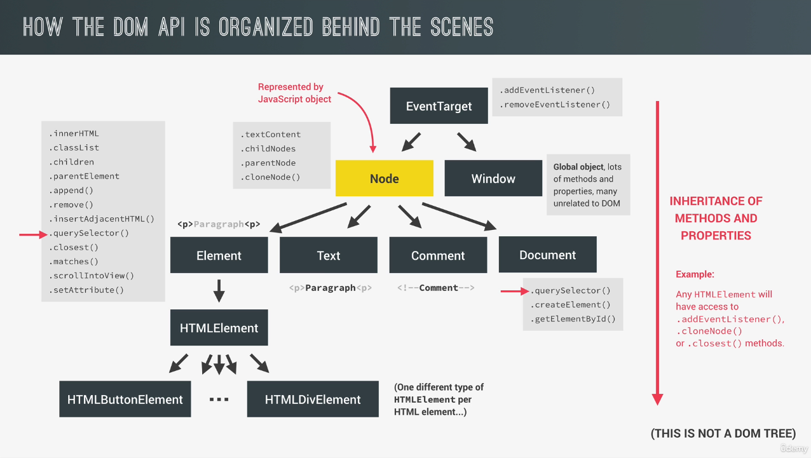

# Advanced DOM and Events

## Table of contents
* [How the DOM Really Works](#how-the-dom-really-works)
* [Selecting, Creating, and Deleting Elements](#selecting-creating-and-deleting-elements)
* [Types of Events and Event Handlers](#types-of-events-and-event-handlers)
* [Event Propagation: Bubbling and Capturing](#event-propagation--bubbling-and-capturing)
* [Event Delegation](#event-delegation)
* [Passing Argument to Event Handlers](#passing-arguments-to-event-handlers)
* [Intersection Observer API](#intersection-observer-api)

## How the DOM Really Works
* DOM is the interface between the browser and our javascript code.
* Allows us to make JavaScript interact with the browser
* We can write JavaScript to create, modify and delete HTML elements; set styles, classes and attributes; and listen and respond to events
* DOM tree is generated from an HTML document, which we can then interact with
* DOM tree is a tree like structure made out of nodes
* DOM is a very complex API that contains lots of methods and properties to interact with the DOM tree



## Selecting, Creating, and Deleting Elements
* DOM elements are unique and can only exist at one place
* Selecting Elements
  * [querySelector](https://developer.mozilla.org/en-US/docs/Web/API/Document/querySelector)
  * [querySelectorAll](https://developer.mozilla.org/en-US/docs/Web/API/Document/querySelectorAll)
  * [getElementById](https://developer.mozilla.org/en-US/docs/Web/API/Document/getElementById)
  * [getElementsByTagName](https://developer.mozilla.org/en-US/docs/Web/API/Document/getElementsByTagName)
  * [getElementsByClassName](https://developer.mozilla.org/en-US/docs/Web/API/Document/getElementsByClassName)
* Creating and Inserting Elements
  * [createElement](https://developer.mozilla.org/en-US/docs/Web/API/Document/createElement)
  * [prepend](https://developer.mozilla.org/en-US/docs/Web/API/Element/prepend)
  * [append](https://developer.mozilla.org/en-US/docs/Web/API/Element/append)
  * [before](https://developer.mozilla.org/en-US/docs/Web/API/Element/before)
  * [after](https://developer.mozilla.org/en-US/docs/Web/API/Element/after)
* Deleting Elements
  * [remove](https://developer.mozilla.org/en-US/docs/Web/API/Element/remove)

## Types of Events and Event Handlers
* Event is a signal that is generated by a DOM node. (e.g. click, mouse moving, ...)
* [MDN Events](https://developer.mozilla.org/en-US/docs/Web/Events#event_listing)
* [EventListener](https://developer.mozilla.org/en-US/docs/Web/API/EventTarget/addEventListener)

## Event Propagation: Bubbling and Capturing
* Capturing phase: The event travels from the document root to the target element
  * it will pass through every single parent element of the target element
* Bubbling phase: The event travels from the target element to the document root
  * it will pass through every single parent element of the target element

## Event Delegation
* When there are a lot of elements handled in the same way, then instead of assigning a handler to each of them, we put a single handler on their common parent.
* This way there is only one function instead of a function for each child element

## Passing Arguments to Event Handlers
```
// The this keyword becomes the passed argument
const message = function(e) {
  console.log(this);
}
// The addEventListener expects a function, and bind returns a new functions!
element.addEventListener('mouseover', message.bind('hello mouseover'));
element.addEventListener('mouseout', message.bind('hello mouseout'));
```

## Intersection Observer API
* [MDN Intersection Observer API](https://developer.mozilla.org/en-US/docs/Web/API/Intersection_Observer_API)
* Allows code to observe changes to the way a certain target element intersects with another element or viewport
```
const observerCallback = function(entries, observer) {
  ...
};
const observerOptions = {
  root: null,
  threshold: [0, 0.2],
};
const observer = new IntersectionObserver(observerCallback, observerOptions);
observer.observe(targetElement);
```