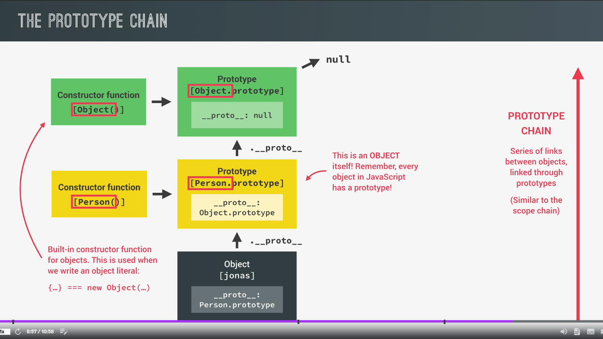

# Object-Oriented Programming (OOP) With JavaScript

## Table of contents
* [What is Object-Oriented Programming?](#what-is-object-oriented-programming)
* [OOP in JavaScript](#oop-in-javascript)
* [Constructor Functions and the new Operator](#constructor-functions-and-the-new-operator)
* [Prototypes](#prototypes)
* [Prototypal Inheritance and The Prototype Chain](#prototypal-inheritance-and-the-prototype-chain)
* [Prototypal Inheritance on Built-In Objects](#prototypal-inheritance-on-built-in-objects)
* [ES6 Classes](#es6-classes)
* [Setters and Getters](#setters-and-getters)

## What is Object-Oriented Programming?
* programming paradigm based on the concepts of objects
* we use object to model (describe) real-world or abstract features
* objects may contain data (properties) and code (methods). By using objects, we pack data and the corresponding behavior into one block
* objects are self-contained pieces/blocks of code
* object are building blocks of applications, and interact with one another
* interactions happen through a public interface: methods that the code outside of the object can access and use to communicate with the object
* class: a 'blueprint' from which we can create new objects
* instance: a new object created from a class

4 fundamental oop principles:
* Abstraction: Ignoring or hiding details that don't matter. Allowing us to get an overview perspective of the thing we are implementing, instead of messing with details that don't really matter to our implementation
* Encapsulation: Keeping properties and methods private inside the class, so they are not accessible from outside the class. Some methods can be exposed as a public interface
* Inheritance: Making all properties and methods of a certain class available to a child class, forming a hierarchical relationship between classes. This allows us to reuse common logic and to model real-world relationships
* Polymorphism: A child class can overwrite a method it inherited from a parent class

## OOP in JavaScript
* JavaScript uses prototypes
* Prototypes contain methods and objects can access methods
  * objects are linked to a prototype object
  * prototypal inheritance: The prototype contains methods (behavior) that are accessible to all objects linked to that prototype
* Behavior is delegated to the linked prototype object

3 ways of implementing prototypal inheritance in JavaScript:
* Constructor functions
  * technique to create objects from a function
  * this is how built-in objects like Arrays, Maps or Sets are actually implemented
* ES6 classes
  * modern alternative to constructor function syntax
  * 'syntactic sugar': behind the scenes, ES6 classes work exactly like constructor functions
  * ES6 classes do not behave like classes in 'classical OOP'
* Object.create()
  * the easiest and most straightforward way of linking an object to a prototype object

## Constructor Functions and the new Operator
* convention: constructor function start with capital letter
* arrow functions will not work as constructor function because it does not have it own `this` keyword, and we need that. So only function declaration and function expressions will work.
* difference between regular function and constructor function, is that we call the constructor with the `new` keyword
* never create methods in constructor functions. Each object will have the function. If we create 1000 object we will have 1000 copies of the function

4 steps happen when using new:
1. An empty object is created
2. `this` keyword in cunstructor function call is set to the new object
3. The new object is linked (__proto__ property) to the constructor function's prototype property
4. The new object is returned from the constructor function call

```
const Person = function(firstName, birthYear) {
    console.log(this); // Person {}
    this.firstName = firstName;
    this.birthYear = birthYear;
    console.log(this); // Person { firstName: "me", birthYear: "1900" }
}

const me = new Person('me', 1900);
console.log(me); // Person { firstName: "me", birthYear: 1900 }
const you = new Person('you', 2000);
console.log(me); // Person { firstName: "you", birthYear: 2000 }
```

## Prototypes
* each function automatically has a property called prototype
* every object created by a constructor function will get access to the methods and properties that we define on the constructor's prototype
```
Person.prototype.calcAge = function() {
    console.log(2050 - this.birthYear)
};
me.calcAge(); // 150
you.calcAge(): // 50

Person.prototype.species = 'Homo Sapiens';
console.log(me.species); // Homo Sapiens
console.log(you.species); // Homo Sapiens

console.log(me.hasOwnProperty('firstName')); // true
console.log(me.hasOwnProperty('species')); // false
```

## Prototypal Inheritance and The Prototype Chain


## ES6 Classes
* syntactic sugar: behind the scenes, ES6 classes work exactly like constructor functions
* still implement prototypal inheritance behind the scenes
* methods added in the class will be on the prototype of the objects and not on the objects itself
* Classes are not hoisted. We can not use them before they are declared in the code.
* Are first-class citizens. We can pass them into functions and also return them from functions.
* Classes are executed in strict mode
```
// class expression
const Person = class {}

// class declaration
class Person {
  constructor(firstName, birthYear) {
    this.firstName = firstName;
    this.birthYear = birthYear;
  }
  
  calcAge() {
    console.log(2050 - this.birthYear);
  }
}

const me = new Person('me', 1900);
console.log(me); // { firstName: "me", birthYear: 1900 }
me.calcAge(); // 150
```

## Setters and Getters
* functions that get and set a value
```
// Regular function
const person = {
  name: 'me',
  birthYear: 1900,
  
  get age() {
    return 2050 - this.birthYear;
  },
  
  set firstName(name) {
    this.name = name;
  }
}

console.log(person.age); // 150
person.firstName = 'you';
console.log(person.name); // you

// Classes
class Person {
  constructor(firstName, birthYear) {
    // this.firstName will call the setter
    this.firstName = firstName;
    this.birthYear = birthYear;
  }
  
  calcAge() {
    console.log(2050 - this.birthYear);
  }
  
  get age() {
    return 2050 - this.birthYear;
  }
  
  set firstName(name) {
    this._firstName = name;
  }
  
  get firstName() {
    return this._firstName;
  }
}

const me = new Person('me', 1900);
//console.log(me.age); // 150
//me.firstName = 'you';
//console.log(me.firstName); // you
```