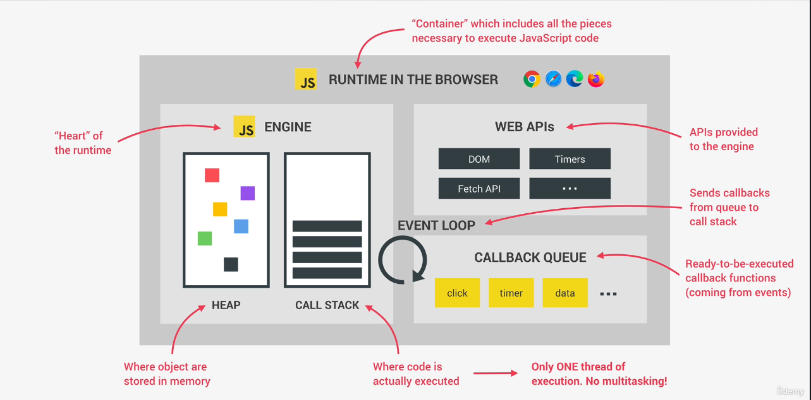

# Asynchronous JavaScript: Promises, Async/Await and AJAX

## Table of contents
* [Asynchronous JavaScript, AJAX and APIs](#asynchronous-javascript-ajax-and-apis)
* [AJAX CAll: XMLHttpRequest](#ajax-call--xmlhttprequest)
* [Callback Hell](#callback-hell)
* [Promises and the Fetch API](#promises-and-the-fetch-api)
* [Consuming Promises](#consuming-promises)
* [Chaining Promises](#chaining-promises)
* [Handling Rejected Promises](#handling-rejected-promises)
* [Throwing Errors Manually](#throwing-errors-manually)
* [Asynchronous Behind the Scenes: The Event Loop](#asynchronous-behind-the-scenes--the-event-loop)
* [The Event Loop in Practice](#the-event-loop-in-practice)
* [Building a Simple Promise](#building-a-simple-promise)

## Asynchronous JavaScript, AJAX and APIs
* Synchronous:
  * most code is synchronous
  * synchronous code is executed line by line
  * each line of code waits for previous line to finish
  * long-running operations block code execution
* Asynchronous:
  * asynchronous code is executed after a task that runs in the "background" finishes
  * asynchronous code is non-blocking
  * execution doesn't wait for an asynchronous task to finish its work
* AJAX:
  * Asynchronous JavaScript And XML: Allows us to communicate with remote web servers in an asynchronous way.
  * request data from web servers dynamically
* API:
  * Application Programming Interface
  * allows applications to talk to each other

## AJAX Call: XMLHttpRequest
* XMLHttpRequest is the old way
```
const request = new XMLHttpRequest();
// type of request and url
request.open('GET', 'https://restcountries.com/v3.1/name/canada');
// send request and fetches the data in the background. And then triggers the load event.
request.send();

request.addEventListener('load', function() {
  // The this keyword is the request object
  const [data] = JSON.parse(this.responseText); // destructure the response to get an object instead of array
  console.log(data); // Object { name: {...}, tld: ..... }
});
```

## Callback Hell
* callbacks inside callbacks inside callbacks ...
* when we have a lot of nested callbacks in order to execute asynchronous tasks in sequence
* in ES6 we can use promises to escape callback hell
```
const request = new XMLHttpRequest();
request.open('GET', 'https://restcountries.com/v3.1/name/canada');
request.send();

request.addEventListener('load', function() {
  const [data] = JSON.parse(this.responseText); // destructure the response to get an object instead of array
  const neighbour = data.borders?.[0];
  
  if (!neighbour) return;
  
  // Get neighbour by code
  const request2 = new XMLHttpRequest();
  request2.open('GET', `https://restcountries.com/v3.1/alpha/${neighbour}`);
  request2.send();
  request2.addEventListener('load', function() {
    const [data2] = JSON.parse(this.responseText);
    console.log(data2.name); // Object { common: "United States", official: "United States of America", ... }
  });
});
```

## Promises and the Fetch API
* [MDN Promise](https://developer.mozilla.org/en-US/docs/Web/JavaScript/Reference/Global_Objects/Promise)
* Promise: an object that is used as a placeholder for the future result of an asynchronous operation
* with promises we no longer need to rely on events and callback functions
* we can chain promises instead of nesting (like XMLHtppRequests)
* Promise lifecycle:
  * pending: before the future value is available
  * settled: asynchronous task has finished
    * fulfilled: successfully resolved in a value
    * rejected: there has been an error during the asynchronous task
```
// Fetch API  returns promise. It builds the promise for ur
const request = fetch('https://restcountries.com/v3.1/name/canada');
console.log(request); // Promise { <state> : "pending" }
```

## Consuming Promises
```
// Fetch API  returns promise. It builds the promise for ur
fetch('https://restcountries.com/v3.1/name/canada').then(function(response) {
  console.log(response); // Response { type: "cors", url: "..." }
  // the json() method is a method that is available on all the response objects that is coming from the fetch function. It is also an asynchronous function and returns a promise
  return response.json();
}).then(function(result) {
  console.log(result[0]); // Object { name: {...}, tld: ..... }
});

// The same but with arrow functions
fetch('https://restcountries.com/v3.1/name/canada').then(response => response.json()).then(result => console.log(result[0])); // Object { name: {...}, tld: ..... }
```

## Chaining Promises
* The then method always returns a promise, even if we return anything or not.
* If we return a value that becomes the fulfilment value of the promise
```
fetch('https://restcountries.com/v3.1/name/canada')
  .then(response => response.json())
  .then(result => { 
    const neighbour = result[0].borders?.[0]
    console.log(neighbour); // USA
    return fetch(`https://restcountries.com/v3.1/alpha/${neighbour}`);
  })
  .then(response => response.json())
  .then(result => console.log(result[0])); // Object { name: {...}, tld: ..... }
```

## Handling Rejected Promises
* the fetch promise only rejects when there is no internet connection. A 404 error will still get fulfilled
* The first callback function will always be called for a successful promise
* The second callback function will be called when the promise was rejected
* catch method schedules a function to be called when a promise is rejected. Catch also returns a promise
* finally method schedules a function to be called when the promise is settled (either fulfilled or rejected)
```
// First way to catch the error - if we have multiple promises we need to add the second callback to all
fetch('https://restcountries.com/v3.1/name/canada')
  .then(response => console.log(response), err => console.log(err));

// Better way to handle the errors - they propegate down the chain
fetch('https://restcountries.com/v3.1/name/canada')
  .then(response => console.log(response))
  .catch(err => console.log(err))
  .finally(() => console.log('this will always be called'));
```

## Throwing Errors Manually
* the promise will immediately get rejected when we throw an error in any then method
* the promise returned by the then method will be a rejected promise and will propagate down to the catch method
```
fetch('https://restcountries.com/v3.1/name/unknown_country')
  .then(response => {
    if(!response.ok) 
      throw new Error(`Country not found ${response.status}`)

    return 'ok'
   })
  .catch(err => console.log(err)); // Error: Country not found 404
```

## Asynchronous Behind the Scenes: The Event Loop
* [MDN event loop](https://developer.mozilla.org/en-US/docs/Web/JavaScript/EventLoop)
* The event loop looks into the callstack and determines whether it is empty or not
  * if it is empty (no code being executed): take the first callback from the callback queue and put it on the callstack
  * it decides when each callback is executed: orchestration
* callback of promises do not go into the callback queue, they go to the microtasks queue
  * microtasks queue has priority over callback queue
  * the event loop will first look into the microtasks queue and processes all of them before going to the callback queue



## The Event Loop in Practice
```
console.log('Test start');
setTimeout(() => console.log('0 sec timer'), 0);
// Promise that is immediately resolved
Promise.resolve('Resolved promise 1').then(res => console.log(res));
console.log('Test end');

Output:
Test start
Test end
Resolved promise 1
0 sec timer
```
* Any top lvl code (code outside any callback) will run first --> Test start and Test end
* Both the timer and promise will finish at the same time (after 0 seconds)
* the promise goes on the microtasks queue
* the timer callback goes on the callback queue
* the microtasks queue has priority over the callback queue
* the promise gets executed first --> Resolved promise 1
* the timer callback gets executed last --> 0 sec timer

the timer callback does not get executed after x seconds, but it will not run before x seconds.  
The following piece of code will show that the log from the setTimeout callback will not show after 1 second.
```
console.log('Test start');
setTimeout(() => console.log('1 sec timer'), 1000);
Promise.resolve('Resolved promise 1').then(res => {
for(let i = 0; i < 1000000000; i++) {}
console.log(res);
});
console.log('Test end');
```

## Building a Simple Promise
* the resolve is the function from the `then` method
* the reject is the function from the `catch` method (or the second function from the `then` method)
* use build promises to wrap old callback based functions into promises
* promisifying: convert callback based asynchronous behaviour to promise based
* [Promise.resolve()](https://developer.mozilla.org/en-US/docs/Web/JavaScript/Reference/Global_Objects/Promise/resolve)
* [Promise.reject()](https://developer.mozilla.org/en-US/docs/Web/JavaScript/Reference/Global_Objects/Promise/reject)
```
const promise = new Promise(function(resolve, reject) {
  setTimeout(function() {
    if (Math.random() >= 0.5) {
      resolve('The random was above 0.5');
    } else {
      reject('The random was below 0.5');
    }
  }, 2000);
});

promise
  .then(result => console.log(result))
  .catch(err => console.error(err));
 
output: sometimes the string 'The random was above 0.5' and sometimes the string 'The random was below 0.5'

// Will resolve immediately
Promise.resolve(123).then(res => console.log(res)); // 123
Promise.reject(123).catch(res => console.error(res)); // 123
```